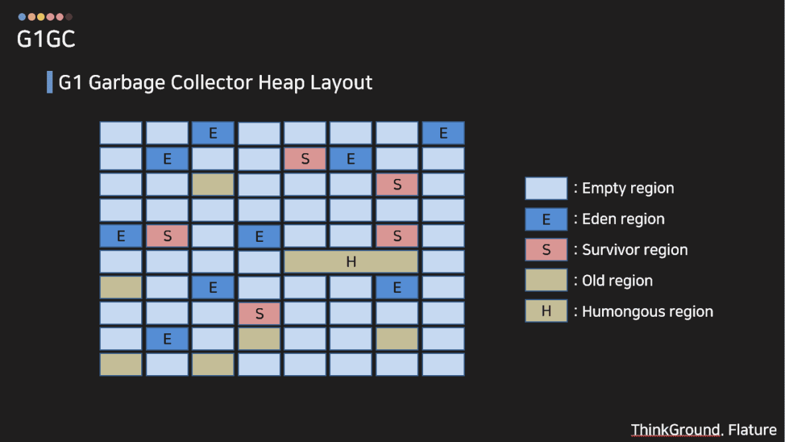
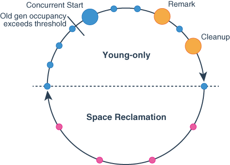
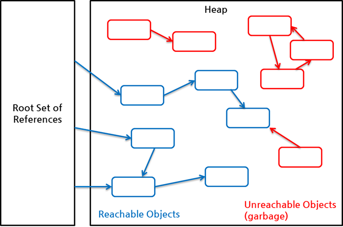

# [G1GC(Garbage-First Garbage Collector)]

## 공부 목적

G1GC 를 공부하며 GC 의 목적이 무엇인지, 어떤 과정을 통해 일어나는지, STW 가 왜 필요한지에 대해 이해한다. 

## 1. G1GC 등장 배경 및 컨셉

G1 GC는 컴퓨터 기술의 발전에 대응하기 위해 등장했다. 트랜지스터 수가 두 배씩 증가했음에도 불구하고 열 방출 문제로 CPU의 클럭 속도가 정체되기 시작하였고, 이로 인해 CPU 설계 철학이 변화했다. 멀티코어 설계가 우선시되었고, 멀티스레드 프로세서를 통해 병렬 처리가 개선되었다.

  메모리 가격이 낮아짐에 따라 컴퓨터의 미래는 병렬화와 멀티기가바이트 힙으로 작업하는 방향으로 나아갔다. 자바는 이러한 자원을 효과적으로 활용할 수 있는 가비지 컬렉터(GC)가 필요했으나, 당시 자바 개발자들이 사용할 수 있었던 GC(Serial GC, Parallel GC, CMS GC)는 이러한 리소스를 적절히 활용하기에 한계가 있었다.

이런 배경에서 G1GC 는  멀티코어 프로세서와 멀티기가바이트 힙을 충분히 처리할 수 있도록 설계되어서 등장했다.

## 2. G1GC 의 메모리 구조



G1GC 는 힙 영역을 같은 크기의 Region 단위로 구분한다.  region 크기가 설정되지 않은 경우 G1은 내부 휴리스틱을 사용하여 max heap size 설정을 기반으로 영역의 수와 영역의 크기를 계산한다.

region 의 유형은 young (Eden/Survivor) / old / humongous / unused 로 구분할 수 있다.

이 중 humongous 는 region 의 절반 이상 크기를 가진 객체를 의미한다. 더 가까운 배수 값에 따라 배치된다. young gc 에 함께 체크되며 참조되지 않을 때까지 메모리 위치를 이동하지 않는다.(jdk21 전까지는)

## 3. G1GC 사이클

*아래 이미지는 G1GC 를 검색하면 가장 먼저 나오는 그림인데 이 그림을 기반으로 이해하려 하니 오히려 헷갈리는 부분이 있었다. young-only 단계에선 이름대로 young 영역의 메모리만 정리가 된다는데, Remark 나 Clean up 단계에서 old 영역의 메모리도 회수가 된다는 설명이 있어 어떤 설명이 사실인지 혼란스러웠다.*



## **4. G1GC 에서 발생하는 GC 타입 구분**

G1 에서 발생하는 GC  타입은  young gc, mixed gc, full gc 로 구분할 수 있다. 

1. Young GC(Minor GC) : eden → survivor / survivor → survivor,old 로 살아있는 객체를 이동시키고 빈 영역을 수거한다.
2. Mixed GC (Minor GC + Major GC) :  young, old 영역에서 발생하며  살아있는 객체가 적은 영역 순으로 영역을 정리하고 빈 영역을 수거한다. 
3. Full GC :  heap 영역 전체를 스캔한다.

## **5. GC의 수거 대상 기준: Reachability**

Java GC는 객체가 가비지인지 팔별하기 위해 `reachability`라는 개념을 사용한다.

이는 객체가 유효한 참조가 있는 경우 `reachable`로 간주하고, 그렇지 않으면 `unreachable` 로 간주하며 해당 객체를 가비지로 처리한다. 이 과정에서 유효한 최초의 참조를 객체 참조의 `root set`이라고 한다.

`root set`은 Java 메모리 구조에서 `reachable`을 결정하는 중요한 요소다. 다음과 같이 구성된다.

- GC Roots
    - java stack 영역의 데이터들 (Java 메서드 실행 시에 사용하는 지역 변수와 파라미터에 의한 참조)
    - method 영역의 static 데이터들
    - JNI(Java Native Interface)에 의해 생성된 객체들



## **6. G1GC 동작 과정**

G1GC 는 병렬로 동작하며 크게 두 단계를 반복한다.

살아 있는 객체를 정리하고(GC), 빈 영역을 free list 에 추가한다.(공간회수)

**Young GC (Minor GC)**

young 영역의 살아있는 객체를 빈 영역으로 이동시키고, 공간을 회수한다. 즉, GC 스레드는 JVM 이 가지고 있는 Free List 에 들어있던 비어있는 Region 을 받아서 살아있는 객체를 옮긴다.  비워진 Region 은 Free List 에 넣는다. 이 작업이 가장 자주 일어나는 일이다.

*이미지 내  `Old gen occupacy exceeds threshold` 단계까지 가지 않고, 다시 사이클을 시작한다.* 

**Q. 공간 회수 단계(Space Reclamation)에서 STW(Stop-the-world) 는 왜 발생할까?**

비어있는 영역으로 값을 카피하고 참조값을 옮길 때 Stop-the-world 가 일어난다. 참조값을 옮기는 작업 전까지 기존 값을 없애지 않고, 기존 참조를 유지하고 있기 때문에 이 시점은 애플리케이션 스레드가 접근해도 문제가 되지 않는다. 문제가 발생하는 지점은 접근한 애플리케이션 스레드에서 쓰기 작업이 발생한 경우이다. GC스레드는 값이 변경되었는지 알 수 없는 상태에서 이전 값을 복사해두고 참조를 변경하는 경우가 발생한다. 이런 경우 값을 변경했음에도 이전 값을 출력하는 상황이 발생할 수 있다. 그렇기 때문에 Stop-the-world 를 발생시켜서 GC 스레드 외의 스레드는 접근하지 못하도록 막는 것이다. 

**Mixed GC (Major GC + 병렬적으로 minor GC 도 일어날 수 있음)**

1. **Initial Mark** **(STW 발생)**
    
    Old Region 에 있는 객체에서 참조하는 Survivor Region (Root Region) 을 찾는다. 
    
    Survivor Region에 의존적이기 때문에 Survivor Region은 깔끔한 상태여야 하고, Survivor Region이 깔끔하려면 Minor GC가 전부 끝난 상태여야 해서  STW 가 발생한다.
    
    *SATB* (Snapshot-At-The-Beginning) **을 사용해서 마킹의 시작 지점인  Root Set  정보의 스냅샷을 남긴다.
    
    ```
    [SATB (Snapshot-At-The-Beginning)]
    
    마킹 사이클이 시작될 때, 힙 메모리에 존재하는 살아있는 객체의 집합을 스냅샷으로 저장한다. 
    이는 시작 시점의 기존 상태를 복사한 것으로, 이후에 변경되는 객체의 정보는 포함되지 않는다. 
    따라서 새로 추가되거나 수정된 객체를 추적하기 위해 write barrier를 사용하여 remembered set에 그 내용을 저장한다.
    
    Remembered Sets에는 객체가 가리키는 포인터 정보가 담겨 있어 새로운 객체나 수정된 객체를 효과적으로 추적할 수 있다. 
    이 방식을 통해 애플리케이션 스레드를 종료하지 않고도 마킹 작업을 수행할 수 있다.
    ```
    
2. **Root Region Scan** 
    
    Initial Mark 단계에서 찾은 Survivor 객체들에 대한 스캔 작업을 실시한다. 멀티 스레드로 동작하며 다음 Minor GC가 발생하기 전에 동작을 완료한다.
    
    ```
    [Remembered Set과 Card Table, Write Barrier]
    
    Remembered Set의 참조 데이터를 업데이트하려면 해당 경로를 따라가며 업데이트해야 한다. 
    Eden 영역과 Survivor 영역을 돌다가 Old 영역을 참조하게 되는 경우가 발생할 수 있다. 
    그러나 Old 영역에는 대부분 살아있는 객체가 존재하기 때문에 Old 영역의 참조 관계를 모두 확인하는 것은 비효울적이다.
    
    마킹 작업을 신속하게 진행하기 위해 Remembered Set 을 만들었지만, Old 영역을 모두 돌아야 하는 상황이 발생할 수 있다. 
    이를 해결하기 위해 적용한 아이디어는 Old 영역에 들어가면 즉시 멈추는 것이다. 
    대신 Old 영역에 있는 객체가 Old 이외의 영역을 가리키고 있을 때, 해당 정보를 미리 업데이트해 두는 방법을 사용한다.
    
    이 방식이 바로 Write Barrier를 활용한 Card Table이다. Old 영역에 들어가면 멈추게 되므로, Old 영역에서 참조하는 객체들을 미리 마킹해 놓는 것이다. 이러한 구조가 Card Table을 형성하고, Card Table을 업데이트하는 데 사용되는 방식이 Write Barrier이다.
    ```
    
3. **Concurrent Mark**
    
    Old Region 이 차지하는 크기가 임계치를 넘어가면(default 45%) 동작한다. 현재 Root Set 에서 출발하는 마킹들을 쭉 해나간다. 공간 회수 단계에서 정리할 Old Region 을 정하는 요소로 사용하기 위해 Old Region 내에서 살아있는 객체를 마킹한다.  
    
    Mark 작업을 수행할 때 young GC 도 발생한다. 마킹이 완료되지 않았더라도 Young GC 가 발생할 수 있다. 
    
    **Q. Eden 영역에서 마킹해뒀는데 이 영역에 새로운 객체가 생기면 어떡하지?**
    
     G1GC 에서는 그럴 일은 발생하지 않는다. GC 스레드가 어떤 영역을 GC 작업 대상으로 정하면 그 영역엔 더이상 새로운 객체가 생기지 않는다. 이전 GC 에서는 eden 영역이 하나 밖에 없기 때문에 생성된 객체가 누락되는걸 막기 위해  마크 - 복사-이동을 모두 마쳐야 STW 가 종료되었다. G1GC 에서는 마크할 때 STW 가 필요 없어졌기 때문에 STW 시간이 줄었다.
    
4. **Remark (STW 발생)**
    
    마킹이 잘 됐는지 확인하는 단계이다. 현재 마킹해둔 상태가 전부인지 검증한다. Initial Mark 단계에서 생성한 스냅샷에 존재하지 않는 새로운 Root Set이 생겼을 수 있기 때문에 스냅샷을 새로 찍어서 비교한다. 새로 생긴 객체들의 참조를 다시 타고 가면서 마킹해서 마킹을 마무리한다.  값이 변경되거나, 객체가 생기거나, 없던 메소드가 로드되거나 등등
    
    concurrent 마크를 다시 하면 안된다. 그럼 또 스냅샷을 찍어서 비교해야 하니 Remark 때 stw 로 멈춰두고, 새로 생긴 애들을 쭉 마킹한다. 
    
5. **Cleanup**
    
    비어있는 Old Region 등을 STW 없이 Free List 에 넣는다. 이 단계에서 영역을 더 비울 필요가 없어지면 GC 가 종료된다.  GC 자체가 마킹을 하면서 필요했던 메타 정보들을 정리한다.
    
6. **Space Reclamation (STW 발생)**
    
    살아있는 객체가 적은 영역 순서로 다른 영역으로 이동 시키고 참조를 바꿔주고 기존 영역을 비우고 Free List 에 넣는다. 이때, 영역을 더 비울 필요가 없어지면 GC 가 종료된다. 
    
    만약 여유 공간이 충분하지 않다면  Full GC 를 발생시켜 메모리를 압축하여 여유공간을 확보한다.
    
    → 즉, G1GC 는 Mixed GC 로 메모리를 최적화하다가, GC 가 동작함에도 여유공간이 부족하면 Full GC(전체 힙 영역 정리) 가 동작하도록 함으로써 여유 공간을 확보한다.
    

## **7. 그래서 GC 를 통해서 하고싶은 건?**

GC 의 본질은 ‘살아있는’ 객체를 어떻게 관리할 것인가의 이야기이다.

GC 스레드는 필요없는 객체의 주소가 어디인지 알지 못한다. 필요없는 객체를 회수 하는 것이 아니라, 살아 있어야 하는 객체를 새로운 메모리 영역으로 이동시키고, 기존 Region 영역 전체를 비운 뒤에 Free List 에 추가해서 재사용한다.
