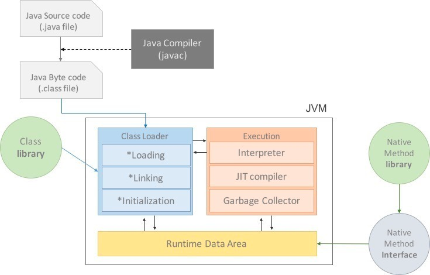
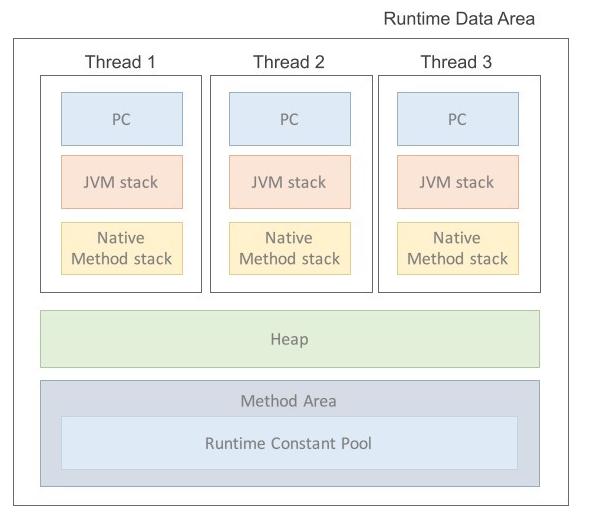
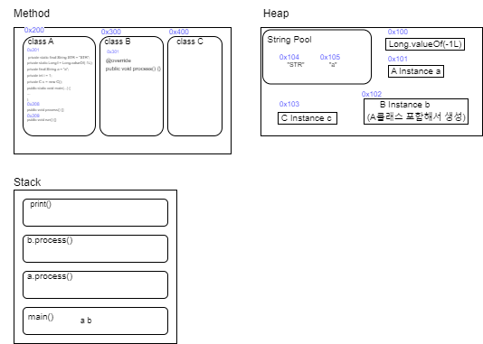
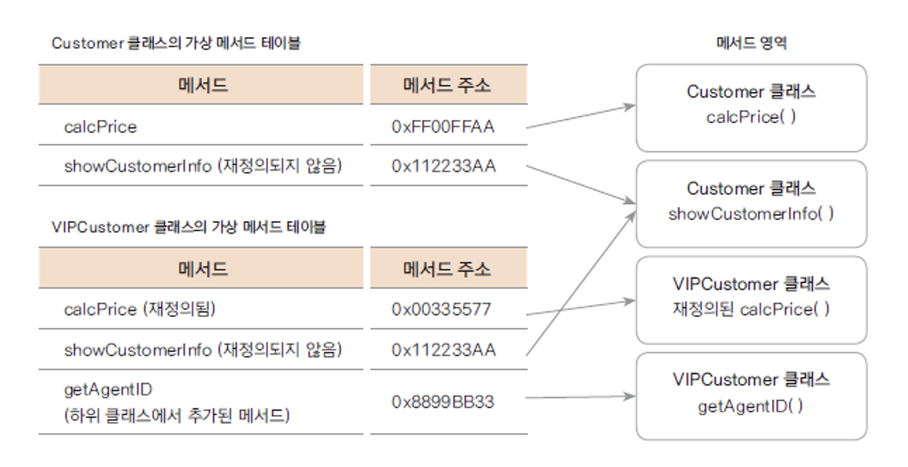

# [JVM]

## · 공부 목적 및 범위

JVM 은 어떻게 구성되어 있는지, 클래스는 어떻게 로드되는지 이해한다.

## 1. JVM 이란
자바 컴파일러가 변환한 바이트 코드를 메모리에 로드하고 실행하는 역할을 한다. 

## 2. JVM 의 동작 방식



1. 자바 프로그램을 실행하면 OS 가 JVM 에 메모리를 할당한다.
2. 자바 컴파일러가 자바 소스 코드(.java)를 자바 바이트 코드(.class)로 컴파일한다.
3. 클래스로더가 동적 로딩을 통해 필요한 클래스들을 런타임 데이터 영역에 로드한다.
4. 런타임 데이터 영역에 로드된 바이트 코드는 실행 엔진을 통해 해석되고 실행된다.
5. 프로그램이 실행되는 동안 실행 엔진에 의해 GC 와 Thread 동기화가 이루어진다.

## 3. JVM 구성 요소
1. 클래스 로더(Class Loader)
2. 실행 엔진(Excution Engine) 
	- 인터프리터(Interperter)
	- JIT 컴파일러(Just-In-Time)
	- 가비지 콜렉터(Garbage Collector)
3. 런타임 데이터 영역(Runtime Data Area)
	- 메소드 영역
	- 힙 영역
	- 스택 영역
	- PC Register
	- 네이티브 메소드
4. JNI 네이티브 메소드 인터페이스(Native Method Interface)
5. 네이티브 메소드 라이브러리


---

### 1.클래스 로더
**클래스 로더의 원칙 4가지**
1. 가시성 원칙 : 자식 클래스로더는 부모 클래스로더가 로드한 클래스를 볼 수 있지만, 부모 클래스로더는 자식 클래스로더가 로드한 클래스를 볼 수 없다.  
2. 유일성 원칙 : 부모가 로드한 클래스를 자식 클래스로더가 다시 로드하지 않아야 하며 이미 로딩한 클래스를 다시 로드해서는 안 된다.  
3. 위임 계층 원칙 : 가시성 원칙과 유일성 원칙을 충족하기 위해서 JVM은 클래스 로딩 요청을 받을 클래스로더를 선택하기 위해 위임 계층을 따른다.  
4. 언로딩 금지 원칙 : 클래스로더는 클래스를 로드할 수는 있지만 이미 로드한 클래스를 언로드(unload) 할 수 없다. 대신 현재 클래스를 제거하고 새로운 클래스를 로드할 수 있다. (gc 동작 또는 was 가 재시작할 때 초기화 된다)  

**클래스 로더의 동작 방식**
1. 로드(Load)
2. 링크(Linking)
	- 검증(Verifying)
	- 준비(Preparing)
	- 분석(Resolving)
3. 초기화(Initialization)

**1. 로드(Load)**

로드 단계에선 바이트 코드를 읽어 메모리에 로드한다. **위임**을 바탕으로 계층적으로 이루어진다.   
애플리케이션 클래스로더가 클래스 로딩 요청을 받았을 때 자기한테서 찾지 않고, 부모 클래스인 확장 클래스로더에 위임한 다음 확장 클래스로더 또한 자신의 부모클래스인 부트스트랩 클래스로더에 위임하여 상위 클래스부터 요청 받은 클래스를 찾도록 한다.  

**Q. 위임 로직을 왜 사용하는걸까?** 

  각 역할과 로딩하는 클래스의 범위가 다르기 때문에 발생할 수 있는 충돌 문제나 보안 이슈를 방지한다.  
  ex) 사용자가 자신이 만든 String 클래스를 사용하려는 경우

- 부트스트랩 클래스로더(Bootstrap classloader) : JVM 자체를 구동할 때 사용되는 핵심 라이브러리들을 로드. 부트스트랩 클래스패스에서 찾는다.(jdk/jre/lib)
- 확장 클래스로더(extension classloader) : 확장 라이브러리들을 로드. 확장 클래스 패스에서 찾는다. (jdk/jre/lib/ext)
- 애플리케이션 클래스로더(application classloader) : 애플리케이션에서 사용하는 클래스 파일들을 로드. 애플리케이션 클래스 패스에서 찾는다. (환경 변수 CLASSPATH) 

**Q. JVM 은 어떻게 main() 가 있는 클래스를 알고 로드할까?**

스프링 부트의 경우 스프링 Preprocessor 가  @SpringBootApplication 어노테이션이 붙은 클래스를 찾아서 jar 파일의 META-INF/MANIFEST.MF 파일에 명시한다. 그래서 JVM 이 알게 되는 것이다. 

**2. 링크(Linking)**
   링크 단계에선 메모리에 로드된 코드 내부의 참조 관계를 연결한다. 검증, 준비, 분석 단계를 거친다.

- 검증(Verifying) : 생성된 바이트 코드가 적절한지 검증한다. 
- 준비(Preparing) : 모든 static 변수에 메모리를 할당하고 기본값으로 초기화한다.  
- 해석(Resolving) : 런타임 상수 풀에 있는 모든 심볼릭 참조를 직접 참조로 대체한다.
(심볼릭 참조 : 이름에 대한 참조, 직접 참조 : 실제 메모리 주소에 대한 참조)

  **Q. 참조를 치환해주는 과정은 왜 이 타이밍에 하는걸까?**
  
  실제 주소로 바꿔주는 과정은 효율적으로 코드를 실행하기 위해 반드시 필요한 일은 맞다. 근데 왜 하필이면 이 타이밍에 하는걸까? c언어의 경우는 컴파일을 할 때 모든 파일을 합쳐서 실행 파일 하나를 만든다.
  이때 모든 파일을 합치는 타이밍에 실제 메모리 주소로 치환할 수 있다. 그 타이밍에 메모리 주소를 모두 가지고 있기 때문이다.  
	 하지만 자바는 필요한 순간에 클래스를 로드하기 때문에 그 전까진 어디에 로드되는지, 메모리 주소를 알  수 없다. 그렇기 때문에 실제 메모리 주소로 바꾸는 과정을 링크 단계에서 할 수 밖에 없는 것이다.  
  이를 다이나믹 로딩이라고 부른다. 링크 단계가 있는 언어들은 대부분 이런 방식을 사용한다. 

**3. 초기화(Initialization)**
   
로드된 각 클래스나 인터페이스의 초기화 로직이 실행된다. 정적 변수들을 코드에 명시된 값으로 초기화하고 정적 초기화 블록이 실행되는 클래스 로딩의 마지막 단계이다.  
· 정적 초기화 블록 : 생성자보다 먼저 호출되며, 인스턴스 초기화 블록(생성자 공통 부분 중복 제거를 위해 사용할 수 있음)/클래스 초기화 블록으로 구분된다. 다양한 명령문 및 제어문을 사용할 수 있으므로 복잡한 초기화를 해야 할 경우 사용한다.

### 2. 실행 엔진 
클래스 로더가 바이트 코드를 메모리에 올리면 기계어로 변환하여 실행하는 역할을 한다. 인터프리터 방식과 JIT 방식을 혼합하여 사용한다.

1. 인터프리터(Interperter)
실행 엔진이 기본적으로 사용하는 방식이다. 바이트 코드를 한 줄 씩 읽고 실행한다. 그래서 속도가 느리다는 단점이 있다.

2. JIT(Just-In-Time) 컴파일러
인터프리터의 속도 문제를 해결하기 위해 디자인된 기능이다. 인터프리트 방식과 정적 컴파일 방식(실행 전 미리 변환)을 혼합한 것이다.  
JIT 컴파일러는 프로그램이 실행될 때 바이트코드를 실행 시점에 기계어로 변환하는 역할을 한다.   
프로그램의 런타임 실행 정보를 실시간으로 분석해서 사용 패턴에 따라 컴파일 함으로써 실행 속도를 향상 시킨다.  
    1. Method JIT : HotSpot VM과 같이 메소드(함수) 단위로 JIT 컴파일을 하는 방식. 자주 호출되는 함수나 메서드의 성능을 크게 향상시킬 수 있다.   
    2. Tracing JIT : Method 보다 더 작은 단위에서 프로그램 실행 흐름을 실시간으로 추적하며 컴파일할 코드를 탐색한다. 실행 시점에만 알 수 있는 정보를 컴파일에 적극적으로 반영한다.  
  
3. 가비지 콜렉터(Garbage Collector)
- 다음 TIL 주제로 다룰 예정이다.


### 3. 런타임 데이터 영역(Runtime Data Area) 
프로그램을 수행하기 위해서 OS에서 할당받은 메모리 공간이다.



1. 메서드 영역 : 프로그램 실행하기 위한 공통 데이터를 관리한다.
	- 클래스 정보: 클래스의 실행 코드(바이트 코드), 필드, 메서드와 생성자 코드 등 모든 실행 코드가 존재한다.  
 	- static 영역 : static 변수들을 보관한다.
	- 런타임 상수 풀 : 프로그램을 실행하는데 필요한 공통 리터럴 상수를 보관한다.(문자열 풀은 자바8부터 힙 영역으로 이동했다.)
					각 클래스와 인터페이스의 상수뿐만 아니라, 메서드와 필드에 대한 모든 레퍼런스까지 담고 있다.  
					즉, 어떤 메서드나 필드를 참조할 때 JVM은 런타임 상수 풀(Runtime Constant Pool)을 통해 해당 메서드나 필드의 실제 메모리상 주소를 찾아서 참조한다.  
					런타임 상수 풀에 레퍼런스를 담을 때, 처음에는 실제 레퍼런스를 가지고 있지 않는다. 클래스가 로드되면 링크 단계를 통해 클래스 이름으로 된 심볼릭 레퍼런스를 실제 클래스의 레퍼런스로 치환한다. 이 과정을 Constant Pool Resolution이라고 한다.

2. 힙 영역 : 데이터를 저장하기 위해 런타임 시 동적으로 할당하여 사용하는 메모리 영역이다.  
	new 키워드로 생성된 객체 인스턴스와 배열이 생성되는 영역이다. 메소드 영역에 로드된 클래스만 생성이 가능하다. 가비지 컬렉션의 주요 대상 영역이며, 더이상 참조되지 않는 객체는 GC에 의해 제거된다. 문자열 풀이 존재한다.(자바8부터)  
	모든 java stack 영역에 참조되어 스레드간 공유가 가능하다.  


3. 스택 영역 : 실제 프로그램이 실행되는 영역이다. 
	각 스택 프레임은 지역 변수(매개변수 포함), 중간 연산 결과, 리턴값, 메서드 호출 정보 등을 포함한다.  
	메서드를 실행할 때마다 스택 프레임이 하나씩 쌓이고, 메서드가 종료되면 해당 스택 프레임이 제거된다.(지역 변수, 매개변수도 함께 제거된다) 스택 프레임이 모두 제거되면 프로그램이 종료된다.  
	스택 영역은 각 스레드별로 하나씩 생성되며 각 스레드 내에 PC register/jvm stack/native method stack가 존재한다.  

4. PC Register : Program counter , 즉 현재 스레드가 실행 중인 스택의 주소와 명령을 저장하는 영역이다. 스레드가 시작될 때 생성되며 이걸 이용해서 스레드를 돌아가면서 수행할 수 있다.  

5. Native Method Stack : 자바로 작성되지 않은 메소드(Native Method)를 지원하기 위한 스택이다. 자바로 작성되지 않은 메소드를 호출 시 JVM Stack 은 동작하지 않고, Native Method Stack 을 사용하여 스택 프레임을 Push, Pop 한다.  
실행 엔진의 컴파일러에 의해 변환된 기계어(Native Code) 역시 여기에서 실행된다.  
	· Native Method 란?  
		Java 언어 외부에서 구현된 메소드를 Java 코드에서 호출하는 메소드를 의미한다.. native 키워드를 사용하여 선언되며 실제 구현은 Java가 아닌 C/C++ 로 이루어진다.   
		JVM 영역을 벗어나 운영 체제의 기능이나 기존의 네이티브 라이브러리에 접근할 수 있게 해준다.   


### 4. JNI 네이티브 메소드 인터페이스(Native Method Interface)
JVM 이 인터프리터 없이 OS 가 바로 읽을 수 있는 형태의 네이티브 코드(Native Method)를 호출할 수 있게 하는 인터페이스이다.  
JNI 는 Java 프로그램이 다른 언어로 작성된 프로그램과 상호 작용할 수 있게 해주는 인터페이스로 C 와 C++ 로 작성된 프로그램과의 상호작용을 위해 사용된다.  
일반적인 Java 코드를 작성하는 것과 동일한 방식으로 외부 함수를 손쉽게 사용할 수 있게끔 도와 주는 역할을 한다.  

### 5. 네이티브 메소드 라이브러리
다른 언어 ((C, C++)로 작성된 라이브러리를 칭한다. 이런 라이브러리는 JNI을 통해 로드될 수 있다.

### 6. 메모리 로드 예시
클래스를 로드하는 단계와, 실제 실행하는 단계를 분리해서 생각해야 한다.

```java
class A { 

  private static final String STR = "STR";
  private static Long l = Long.valueOf(-1L);
  private final String a = "a";
  private int i = 1;
  private C c = new C();
  
  public static void main(...) {
  
    A a = new A();

    B b = new B();
    
	a.process();
	b.process();
    System.out.println(A.STR); 
  }
  
  public void process() {}
  
  public void run() {}

}

class B extends A {
  @override
  public void process() {}
}

class C {
  // ...
}
```

위 클래스 A 를 로드하고 실행하면 메모리 영역에 이런 식으로 들어가게 된다.




```java

// 클래스 전체를 메소드 영역에 로드된다. 각 클래스 별로 가상 메소드 테이블이 생성된다.  
// (클래스 변수, 인스턴스 변수, 메소드, 메소드의 내용 등 전체) 
// 단지 필드들은 초기화의 대상이고 메소드는 초기화의 대상이 아닐 뿐이다.  
// 메타 정보로 'STR 변수는 스트링 "STR" 이야.' 라는 정보 등이 메소드 영역에 들어가있다.

class A { // 0x100

  // final 이기 때문에 메모리 값을 재할당 받을 수 없다. 
  // 최근 버전의 JVM 에서는 파이널 변수를 JVM 에 올리지 않고 상수 취급한다.
  // jdk 마다 다르기 때문에 절대적인건 아니지만 그런 최적화들이 들어가 있다.
  // 클래스 변수 STR, l 은 클래스가 로드 되는 시점에 메소드 영역에에 같이 로드된다. 
  // "STR"은 힙 영역의 문자열 상수풀에 로드, Long.valueOf(-1L)은 힙 영역에 로드한다.
  // 0x104
  private static final String STR = "STR";
  // 0x108
  private static Long l = Long.valueOf(-1L);

  // 인스턴스 변수는 객체 생성 시점에 로드된다.
  // "a" 는 문자열 상수풀에, C 인스턴스는 힙 영역에 로드된다.
  //  a, i, c 도 마찬가지로 힙 영역에 로드된다. (힙 영역에 A 객체가 로드되므로)
  private final String a = "a";
  private int i = 1;
  private C c = new C();

  // 0x200
  // 이 라인을 실행했을 때
  // 스택영역에 main()이 쌓인다, a, b도 스택에 쌓인다.
  public static void main(...) {
   
    // new A(), new B()는 힙영역에 로드된다.
    A a = new A();
    B b = new B();


    // 스택에 쌓인다
    a.process();
    b.process();
    System.out.println(A.STR); // print reference 0x104
  }
  
  public void process() {}

  // 이런 메소드의 경우 A 클래스와 B클래스의 메소드 테이블에 같은 주소값이 들어간다.
  // 크고 작고를 떠나 메모리의 낭비이므로 private, protected 같은 접근제어자를 잘 쓰는게 좋다.
  public void run() {}

}

// B 는 객체가 생성될 때 A 의 내용을 포함해서 힙 영역에 로드된다.
// super() 메소드로 A 의 생성자 메소드를 호출해서 A 클래스 관련 값들을 초기화한다.
class B extends A {
  // private final String a = "a";
  // private int i = 1;
  // private C c = new C();
  // public void process() {}
	// public void run() {}
	
  //public static void main(...) {
   // // ...
  //}
  
  // 메소드 테이블에 오버라이딩한 메소드의 주소가 들어간다.
  // 자식 객체가 부모 타입으로 선언되어도 오버라이딩된 메소드가 호출되는 이유이다.
  @override
  public void process() {}
}

class C {
  // ...
}
```


### 7. 메소드 테이블 (method table)
메소드 테이블은 각 클래스마다 존재하고, 클래스가 메모리를 할당 받을 때 자신의 메소드와 상속받은 모든 메소드의 주소를 정리한 테이블이다.  
JVM 이 클래스를 로드할 때, 메소드 영역에 메소드를 로드하고 메소드 테이블을 생성한다.   
메소드 테이블은 각 메소드의 이름과 실제 메모리 주소가 한 쌍이 된다. 어떤 메소드가 호출되면 이 테이블에서 실제 메모리 주소값을 찾아 메소드 바이트코드를 실행한다.  

 


**참고하면 좋을 강의**
https://www.codelatte.io/courses/java_programming_basic/IGO4YNAECLV8MSVF
