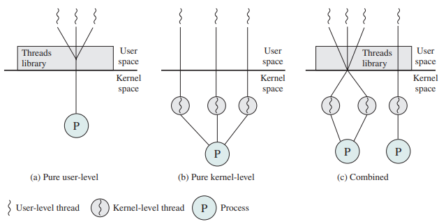
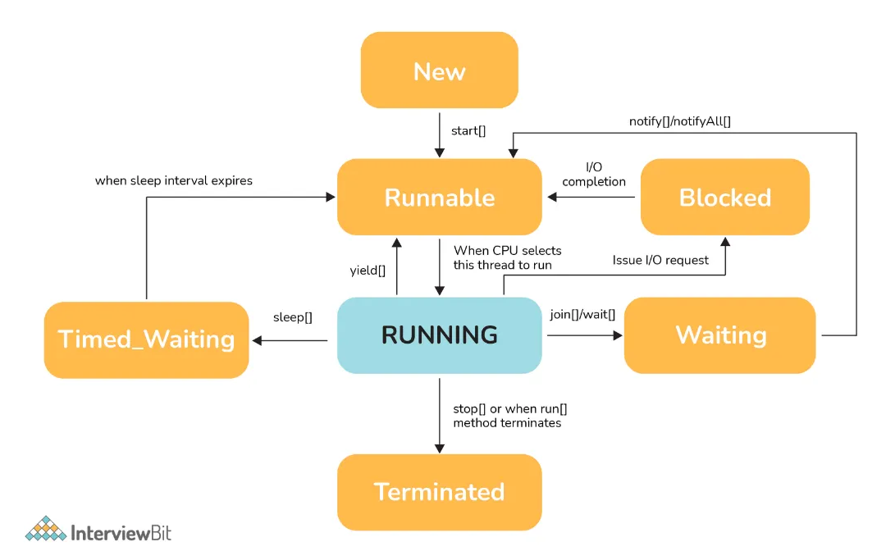

## 1. 스레드란?

**프로세스**는 운영체제에서 독립된 메모리 공간을 갖는 하나의 실행 단위이다. 즉, 각 프로세스는 고유의 주소 공간을 가지며, 다른 프로세스와 메모리를 공유하지 않는다.

**스레드**는 프로세스 내에서 독립적으로 실행되는 실행 단위이다. 하나의 프로세스는 여러 스레드를 포함할 수 있으며, 각 스레드는 해당 프로세스 내의 메모리 공간(힙 영역, 메소드 영역)을 공유한다. 

`💡스레드는 독립적인 실행 단위는 맞지만 스스로 무언가 작동하는 개념이 아니다. 스레드는 메모리 상에 존재하는 데이터 덩어리이고 CPU 코어 위에 얹어져야 동작한다. 운영체제 스케줄러가 코어에서 동작할 스레드 정보를 잘 복사해서 코어에 잘 넣었다가, 다시 빼서 어디까지 진행했는지 등을 업데이트해서 다시 복사해두고를 반복한다.(PCB, TCB) 스케줄러가 동작하면서 스레드가 실행되고 컨텍스트 스위칭이 발생한다.`

## 2. 스레드 구분

1. **하드웨어 스레드**
    
    하드웨어 스레드는 물리적인 CPU core 에서 실행되는 작업 단위를 의미한다.

    `💡하드웨어 코어가 두 개의 스레드를 논리적으로 운영한다는 이야기. 인텔의 하이퍼 스레딩처럼 물리적으로는 코어가 하나인데 논리적으로 코어가 2개인 것처럼 나눠서 사용하는 것(동시 실행) 을 의미한다.`
    
2. **소프트웨어 스레드**
    1. **사용자 레벨 스레드(User-level Thread)**
        
        운영체제가 아닌 사용자 프로그램에 의해 관리되는 스레드이다. 생성, 스케줄링, 종료와 같은 작업을 커널이 아닌 런타임 라이브러리에서 수행한다.
        
         커널은 모든 스레드를 하나의 프로세스로만 인식한다. 한 스레드가 블락되면 같은 프로세스 내의 다른 스레드도 블락된다. 하지만 운영체제의 스케줄러와 상호작용하지 않기 때문에 문맥 교환 비용이 적고, 빠르다. (스레드끼리 Heap / Method 메모리 공유하기 때문)  자바의 Green Thread 가 여기에 속한다. 
        
    2. **커널 레벨 스레드(Kernel-level Thread)**
        
        운영체제의 커널이 직접 관리하는 스레드이다.  운영체제가 스레드를 인식하고 스케줄링, 생성, 실행, 관리 등의 작업을 수행한다. 문맥 교환도 운영체제에 의해 이루어진다. 따라서 사용자 수준에서 관리하는 User-level-Thread 보다 더 많은 리소스를 사용한다. 
        
         여러 CPU 코어를 사용하는 환경에서 병렬 처리를 할 수 있다. 여러 스레드가 동시에 다른 CPU 코어에서 실행될 수 있어 멀티  코어 환경에서 성능이 향상된다. 한 스레드가 블락되더라도 동일한 프로세스 내의 다른 스레드는 계속 실행될 수 있다. 
        
        커널이 스레드 간의 문맥 교환을 하기 때문에 사용자 레벨보다 비용이 높다. 커널 수준에서 각 스레드의 상태를 저장하고 복원하는 작업이 추가되기 때문이다.
        

## 3. 멀티스레드란?

하나의 프로그램이 동시에 여러 스레드를 사용하여 작업을 수행하는 방식이다. 멀티스레드를 사용하면 프로그램의 여러 부분을 동시에 처리할 수 있기 때문에 성능이 향상된다. 하지만 스레드 간의 문맥 전환이 빈번하게 발생하면 스케줄링과 문맥 교환으로 인한 오버헤드가 발생할 수 있다.

## 4. 멀티스레딩 모델

`💡어떤 모델을 사용하느냐는 운영체제가 정한다!`   

1. **Many-to-One (자바의 Green Threads)**
    
    여러 사용자 스레드가 하나의 커널 스레드에 매핑된다. 사용자 스레드가 독립적으로 생성되지만, 커널 스레드가 하나이기 때문에 하나의 사용자 스레드가 블락/Waiting 되면 모든 스레드가 블락/Waiting 상태가 된다. 이 모델의 장점은 문맥 전환이 빠르고 사용자 공간에서 스레드를 관리하기 때문에 효율적이다. 하지만  멀티코어 CPU 환경에서 병렬 처리가 불가능하다는 단점이 있다.
    
    초기 자바에서는 멀티 스레딩을 지원하기 위해 런타임 라이브러리 또는 JVM이 사용자 레벨 스레드를 생성하고 관리 및 스케줄링했다. 이렇게 자바에서 생성된 스레드를 Green Thread라고 부른다.  Green Thread는 Many-to-one 모델로 설계되어 아무리 Green Thread가 많아도 커널에서 관리되는 스레드는 단 한 개 뿐이다. CPU를 하나 밖에 사용하지 못 하기 때문에 단일 코어 시스템에선 장점이었지만 반대로 멀티 코어 환경에선 장점을 전혀 살리지 못 한다. 
    
2. **One-to-One (Linux)**
    
    하나의 사용자 스레드가 하나의 커널 스레드에 매핑된다. 각 사용자 스레드는 커널 스레드와 직접적으로 연결되어 있어 하나의 스레드가 블록되더라도 다른 스레드는 계속 실행될 수 있다.  멀티코어 시스템에서 병렬 처리가 가능하지만, 각 사용자 스레드마다 커널 스레드가 필요하므로 시스템 자원을 많이 소모할 수 있다. 
    
3. **Many-to-Many (Solaris)**
    
    여러 사용자 스레드가 여러 커널 스레드에 매핑된다. 사용자 스레드의 수와 커널 스레드의 수가 다를 수 있으며, 사용자 스레드는 커널 스레드 중 하나에 동적으로 매핑됩니다. 이 모델은 멀티코어 환경에서 효율적인 병렬 처리가 가능하며, 다대일 모델의 자원 사용 효율성도 갖고 있지만 구현이 복잡할 수 있다. 하나의 사용자 스레드를 두 개의 커널 스레드와 매핑하는 경우는 없다. 두개의 사용자 스레드를 하나의 커널이 매핑된다. 요청하는 스레드가 더 많고 이 스레드를 관리하는 커널 스레드는 더 적으니까 어떤 타이밍에는 2개 이상의 사용자 스레드를 갖고 있을 수 밖에 없는상태가 된다. 스레드풀과 혼동하면 안된다.
    

## 5. 멀티스레드 환경에서 발생하는 동시성 문제

`💡실제로 스프링에서 코드를 작성하면서 멀티스레드 환경에서의 동시성 이슈에 대해 고민할 일은 없다. 애초에 스레드 2개가 같은 자원으로 접근하게 코드를 짜지 않는다. 상태가 없기 때문에 충돌도 발생하지 않는다. 프레임워크 안에서는 사용하고 있지만, 실제로 우리가 개발할 때는 사용하지 않는게 일반적이다. 그래서 이제 잘 다루지 않는 개념이다.` 

### **동시성 문제**

여러 스레드는 동일한 메모리 공간을 공유하기 때문에 멀티스레드 환경에서 스레드가 동시에 자원에 접근하거나 작업을 수행할 때 동시성 문제가 발생할 수 있다. 주로 여러 스레드가 접근 할 수 있는 임계 구역(Critical Section) 에서 일어난다. 주로 다음과 같은 상황에서 나타난다.

1. **경쟁 조건(Race Condition)**
    
    두 개 이상의 스레드가 공유 자원을 동시에 접근하고, 그 결과가 실행 순서에 따라 달라질 때 발생하는 문제이다. 예를 들어, 두 스레드가 같은 변수를 수정할 경우, 값을 읽고 수정하는 순서가 스레드마다 달라서 예기치 않은 결과가 발생할 수 있다. 동기화되지 않은 공유 자원에 대한 접근이 원인이 된다. (동기화 문제)
    
2. **데드락(DeadLock)**
    
    두 개 이상의 스레드가 서로 자원을 잠그고, 상대방이 가진 자원을 기다리면서 무한 대기 상태에 빠지는 현상이다. 각 스레드가 상대방의 자원이 해제되기를 기다리기 때문에 프로그램이 멈추게 된다. (데드락이 발생하기 위한 네 가지 조건 : 상호 배제, 점유 및 대기, 비선점, 순환 대기)
    
3. **라이브락 (LiveLock)**
    
    두 스레드가 서로 상대방을 방해하지 않기 위해 계속해서 상태를 바꾸지만, 실제로는 작업을 진행하지 못하는 상태이다. 데드락과 비슷하지만, 스레드들이 계속해서 동작은 한다는 차이점있다.
    
4. **기아상태 (Starvation)**
    
    특정 스레드가 자원을 얻지 못해 실행되지 못하는 현상이다. 우선순위가 낮은 스레드가 계속해서 자원에 접근하지 못하거나, 자원을 독점하는 스레드에 의해 차단되는 경우 발생할 수 있다.
    

### **멀티스레드 환경에서 동기화 문제를 막기 위한 메커니즘**

1. **세마포어(Semaphore)**
    
    세마포어는 공유 자원에 접근할 수 있는 스레드의 수를 제한하는 동기화 도구이다. 세마포어는 카운터 값을 통해 스레드의 접근을 관리한다. 카운터가 0보다 크면 스레드는 자원에 접근할 수 있고, 카운터가 0이면 스레드는 대기해야 한다.
    
     주로 여러 스레드가 동시에 자원에 접근해야 하지만, 그 수를 제한해야 할 때 (예: DB 커넥션 풀) 사용된다. 이진 세마포어와 카운팅 세마포어로 구분할 수 있다. 이진 세마포어는  0과 1만 가지며 뮤텍스처럼 작동하며, 카운팅 세마포어는 1보다 큰 값으로 설정할 수 있다.
    
    자바에서 사용하려면 `Semaphore` 클래스를 사용하면 된다.
    
2. **뮤텍스(Mutex)**
    
    뮤텍스는 **상호 배제를 보장**하는 동기화 도구로, 하나의 스레드만이 공유 자원에 접근할 수 있도록 잠금을 제공한다. 뮤텍스를 사용하는 스레드는 자원을 사용할 때 잠금을 걸고, 사용이 끝나면 잠금을 해제한다. 뮤텍스는 한 번에 **오직 하나의 스레드**만 자원에 접근할 수 있도록 보장한다.
    
    자바에서 뮤텍스는 주로 `ReentrantLock` 클래스를 사용하여 구현된다. 명시적으로 잠금과 해제를 관리해야 하며, 주로 **단일 자원에 대해 동시 접근을 방지**해야 하는 경우에 사용된다. 예를 들어, 파일 읽기/쓰기나 은행 계좌와 같은 단일 인스턴스에 대한 동시 접근을 막을 때 사용된다.
    
3. **모니터(Monitor)**
    
    모니터는 **상호 배제와 조건 대기**를 결합한 고수준의 동기화 메커니즘이다. 모니터는 자바에서 `synchronized` 키워드를 통해 구현되며, 자원에 대한 잠금을 자동으로 관리한다. 스레드가 임계 영역에 진입할 때 잠금을 걸고, 임계 영역을 벗어나면 자동으로 잠금을 해제한다. 또한 모니터는 **조건 변수를 통해 스레드가 특정 조건을 충족할 때까지 대기**할 수 있는 기능을 제공한다.
    
    모니터는 여러 스레드가 특정 조건을 만족할 때만 자원에 접근하도록 제어해야 할 때 유용하며, 자바의 기본 동기화 메커니즘으로 널리 사용된다.
    

## 6. 자바에서 new thread() 시 발생하는 일

1. 메인 스레드가 새로운 스레드를 생성한다.
    
     `new Thread()` 또는 `Runnable`을 구현한 객체로 새로운 스레드 인스턴스를 만든다.
    
2. `start()` 메소드로 스레드 실행을 시작한다.
    
    스레드의 `start()` 메소드를 호출하면 JVM 은 JNI 을 통해 네이티브 메서드인 `start0()` 을 호출하고 실제 스레드 실행을 준비한다.  이때 JVM 은 운영체제에 커널 스레드를 생성해달라고 시스템 콜을 보낸다.
    
3. 커널 스레드가 생성되고, 자바 스레드와 커널 스레드가 1:1 로 매핑된다. (네이티브 스레드)
4. 커널 스레드는 운영체제 스케줄러로부터 CPU 할당을 받기 전까지 대기한다.
5. 스케줄러에 의해 커널 스레드가 실행 상태가 되면 매핑된 자바 스레드의 `run()` 을 호출한다 . 

## 7. 운영체제의 스레드 관리

1. **스레드 풀**
    
    자바 스레드와 커널 스레드가 1:1 매핑된다고 해도 자바 스레드를 생성 할 때마다 OS 스레드가 매번 생성되는 것은 아니다. 스레드풀에 작업이 끝난 OS 스레드가 있다면 이미 매핑한 적이 있다고 하더라도 가용한 OS 스레드와 다시 매핑을 하여 작업을 진행한다.
    
    `💡처음엔 기본으로 설정된 수만큼 스레드를 미리 생성해두고, 그 안에서 돌아가며 사용하는 개념이라고 이해했다. 그런데 예상과 달리, 기본 설정으로 생성 가능한 스레드의 개수가 제한되어 있긴하지만 설정을 바꾸면 무한정으로 생성할 수 있다. 물론 스레드를 끝없이 생성하면 컨텍스트 스위칭 비용이 높아지니깐 스레드를 많이 생성하지 않는 것이 성능 상 유리한건 맞다. 하지만 생성할 수 있는 스레드의 개수가 제한되어 있지는 않다. 
    스레드풀의 동작 방식은  1:1 로 사용자 스레드와 매핑되어 있던 커널 스레드가 종료되어 다시 스레드 풀에 들어오면 아주 짧은 시간동안 살아있다. 그동안 스레드를 달라는 요청을 받으면 재사용한다. 요청이 없는 경우 메모리를 해제한다.`
    참고 : [How Java thread maps to OS thread?](https://medium.com/@unmeshvjoshi/how-java-thread-maps-to-os-thread-e280a9fb2e06)
    
    
2. **문맥 교환(Context Switching)**
    
    하나의 프로세스 또는 스레드의 실행을 중단하고, 다른 프로세스 또는 스레드로 전환하는 과정이다. 이때 운영체제는 현재 실행 중이던 프로세스의 상태[문맥: CPU 레지스터, 프로그램 카운터(현재 실행 중인 명령어의 위치), 메모리 관리 정보 등]를 PCB(Process Control Block) 저장하고, 새로운 프로세스의 상태를 불러온다.
    
    멀티태스킹, 입출력 대기, 우선순위 변경 등이 일어날 때 문맥 교환이 발생한다.
    
3. **스케줄링** 
    
    CPU와 같은 자원을 여러 프로세스(프로그램이 실행 중인 상태)나 스레드(프로세스를 구성하는 독립적인 단위)가 효율적으로 사용할 수 있도록 실행 순서를 결정하는 과정이다. 
    
    스케줄러는 시스템 성능을 최적화하기 위해 프로세스가 CPU를 사용할 시점을 스케줄링 알고리즘(실행 순서를 결정하는 방법) 에 따라 조정한다. 
    
    대기 큐에 실행 가능한 스레드들이 담겨있고, 스케줄링 알고리즘에 따라 실행할 스레드를 대기 큐에서 선택한다. 선택된 스레드에게 CPU가 할당된다. 
    
    1. **선점형(Preemptive Scheduling)**
        
        실행 중인 프로세스를 강제로 중단시키고, 다른 프로세스가 CPU를 사용할 수 있도록 하는 방식이다. 우선순위가 높은 프로세스가 도착하면 현재 실행 중인 프로세스는 CPU 를 강제로 반환해야 한다.  라운드 로빈, 우선순위 기반 스케줄링 등이 있다. 
        
        **Q. 자바의 스레드에 설정한 우선순위가 운영체제의 스케줄링에 반영이 될까?**
 
        `💡자바에서 설정한 스레드 우선순위는 운영체제의 스레드 스케줄러에 전달되지만, 운영체제마다 스레드 우선순위 처리 방식이 다르기 때문에 스레드 우선순위가 무시되거나 제한적으로만 반영될 수 있다.`
   
        
    2. **비선점형 (Non-Preemptive Scheduling)**
        
        한 프로세스가 CPU를 점유하면, 그 프로세스가 종료되거나 I/O 작업을 위해 스스로 CPU를 반환할 때까지 다른 프로세스가 CPU를 사용할 수 없는 방식이다. 
        
        FCFS (First-Come, First-Served), SJF (Shortest Job First) 등이 있다.
        
    
    선점형 스케줄링은 더 높은 우선순위의 작업을 빠르게 처리할 수 있지만, 문맥 교환 오버헤드가 발생할 수 있다. 비선점형 스케줄링은 시스템 오버헤드가 적지만, 긴 작업이 CPU를 독점할 위험이 있다.
    
4. **스레드의 라이프 사이클**
    
    `💡스레드의 상태를 바꾸는 주체는 누구인가? 커널 또는 코어가 상태를 바꾼다. 예를 들어 커널이 코어에 스레드를 집어 넣는 순간 스레드의 상태는 Runnable 이 된다.  코어가 어떤 명령을 실행했는데, 지금 I/O 웨이팅 상태라면 스레드의 상태를 Waiting 으로 바꾼다.` 
    
    
    
    - New (새로 생성됨) : 스레드 생성된 상태이다. ex)  `Thread th = new Thread()`
    - Runnable (실행 가능) : CPU 할당 여부에 따라  실행 대기중/실행 중인 상태이다. ex)  `start()` 메서드 호출된 후
    - Blocked (차단됨) : 스레드가 I/O 작업이나 동기화 블록에 의해 자원이 잠겨서 대기하는 상태. 다른 스레드가 자원을 해제할 때까지 이 상태에서 기다린다.
    - Waiting(대기) : 특정 조건이 충족되기를 무기한으로 기다리며 다른 스레드가 이 스레드를 깨울 때까지 계속 대기한다.
    - Timed Waiting (시간 제한 대기) : 특정 시간 동안 기다리며 시간이 지나면 다시 실행 가능 상태로 돌아간다. ex) `sleep()` `join(long timeout)` 메서드를 호출할 때 발생한다.
    - Terminated (종료됨) : 스레드의 작업이 완료되어 실행이 종료된 상태. 스레드가 `run()` 메소드를 모두 실행하거나, 예외가 발생해서 종료되면 이 상태가 된다. 이 상태가 된 스레드는 다시 실행될 수 없다.

## 8.  GC 수행 시 STW 가 발생할 수 밖에 없는 이유

GC 공부를 할 때,  STW 는 GC 의 안정성을 위해 GC 스레드를 제외하곤 모든 스레드의 동작을 멈추는 것이라고 학습했다. 

 그럼 다른 스레드는 왜 그때 동작하는거지? GC 할 때는 GC 스레드만 딱 뜨면 되는데? 그러면 문맥 교환도 안해도 되고 CPU 의 모든 코어를 GC 스레드에 몰아주면 빨리 끝나고 좋잖아? 근데 왜 STW 를 사용해야 하는거야? 라는 질문을 받았다. 그때 들으면서 드는 생각은.. 🤔 오…그러네..? 였다. 하지만 JVM 이 바보도 아니고 STW 를 할 수 밖에 없는 이유가 있는거니 그 이유가 무엇인지 공부해야 했다. 

이번에 Thread 를 공부하면서 찾은 답은  “자바의 스레드는 커널 스레드와 1:1 로 매핑되어 OS 가 스케줄링하기 때문이다. ” 이다.

 OS는 스케줄링에 따라 스레드를 실행하는 역할을 한다. 스레드를 커널 스레드로만 인식하며 각 스레드가 어떤 역할을 하는지  알지 못한다. (자바의 GC 스레드인지, 애플리케이션 스레드인지)  그렇기 때문에 대기 큐에 있는 스레드를  OS 가 구별해서 실행 할 수 없다.  OS 는 스레드의 상태에 따라 스케줄링을 실행할 뿐이고 애플리케이션 스레드와 GC 스레드는 JVM 내에서만 구분하고 관리할 수 있다. 이것이 JVM 에서 STW 를 사용할 수 밖에 없는 이유이다.
