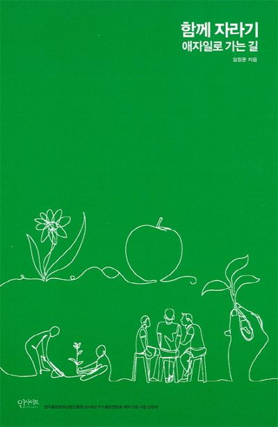

## 도서 : 함께자라기 ~ 애자일로 가는 길 ~

책을 고를 때 단순히 내가 읽고 싶은 책/기술 서적으로만 구분했지 소프트 스킬을 고려해본 적은 없었다.   
비록 지금은 퇴사한 상태이지만 회사 생활을 하면서 궁금했던 점,    
알아야 하는지도 모르는 채 지나치고 있던 점들을 책을 통해 알 수 있었다.    
읽으면서 인상 깊었던 부분, 기억하고 싶은 조각을 남겨본다.   

### **제자리 걸음에서 벗어나기** (p.65)
회사에서 업무를 하면서 지루함과 불안함을 느껴본 경험은 다들 있을거라 생각한다. 물론 나또한 그렇다.   
그런 경우 지루할 때는 멍 때리며 시간을 보내기도 했고, 불안할 때는 야근을 하며 시간을 투자하는걸 위안 삼았다. 그 시절에 이 책을 읽었더라면 좋았을텐데, 하는 생각이 든다.   
책에서는 그런 경우에 적용할 수 있는 방법을 소개해준다.   

- 지루함을 느끼는 경우 : a1 실력 낮추기   
- 지루함을 느끼는 경우 : a2 난이도 높이기   
- 불안함을 느끼는 경우 : b2 실력 높이기   
- 불안함을 느끼는 경우 : b1 난이도 낮추기   

### **객관성의 주관성 - 감정을 배제할 수 없다** (p.140)   
직장 동료는 사람이다. 후배도 사람이고, 선배도 사람이고 상사도 사람이다.    
논리적인 근거를 바탕으로 소통하는 것도 중요하지만, 개개인을 고려하는 것도 중요하다.   
당장 이번달 안에 모든 팀원들을 설득해서 함께 무언가를 시작할 수 있을까? 상상해보니 너무 어려운 일인 것 같다.   
업무 처리뿐만 아니라 좋은 인간관계를 만드는 일도 중요하다는걸 느꼈다.   

### **이것도 모르세요?** (p.145)   
신입 시절, 아무도 나에게 이렇게 말하지 않았지만 긴장된 상태라 그런지 모르는걸 모른다고 말하는게 너무나 어려웠다.   
이것도 모른다고 생각하면 어떡하지? 라는 불안이 컸다.   
아무래도 수습 3개월 뒤 어떻게 될지 모르니... 불안감에서 오는 스트레스가 컸던 탓이다.    
 
책에서는 의사소통, 멘토링, 코칭 능력이 떨어지는 사수와 부사수의 의사소통이 예시로 나오는데 누구에게도 득이 되지 않는 의사소통이었다. 코칭을 잘 할 줄 아는 사람이 되고 싶다.    
소통 없이 "이것도 모르세요?" 정도의 소통만 일어나는 팀 말고, 서로 코칭을 잘 해줄 수 있는 팀에서 일하고 싶다는 생각이 많이 들었다.    

### **하향식 접근의 함정 - 빠르고 빈번한 바통 터치가 가능한 전문가 조직** (p.159)   

- 삼투압적 의사소통   
    - 은연 중에 서로 간에 정보가 스며드는 것   
- 한번에 처리되는 일의 양을 줄여야 한다. (배치 사이즈)   
    - 배치 사이즈를 줄여서 지속적 흐름을 만들고 짧은 시간 내에 탑, 바텀을 오가도록 한다.   

이런 의사소통은 물리적인 거리가 가까울수록 좋고, 대화의 수신자/송신자가 정해져있지 않으며 모두가 듣고 대화에 참여할 수 있다고 한다.   
회의를 잡아서만 소통할 수 있는 환경이 아닌, 일상적으로 소통하는 팀에서 함께 일하고 싶다.   

### **구글이 밝힌 탁월한 팀의 비밀** (p. 167) 
- 심리적 안전감 : 내 생각이나 의견, 질문, 걱정, 혹은 실수가 드러났을 때 처벌받거나 놀림받지 않을 거라는 믿음   

가장 중요하지만 갖기 어려운 믿음 같다. '새롭게 팀에 합류하면 나를 평가할 수밖에 없을텐데' 라는 생각에 스스로 갇히게 된다.     
'내가 지금 바보같은 말을 하고 있는건가?' 라는 걱정을 버리고 싶다.     
'가끔 바보같을 수도 있지 뭐. 혼자 속으로 바보같이 생각하고 끝내는거보다야 말해서 바보같다는걸 알게되는 게 더 좋은 일이다.' 하고 생각하는 연습을 해야겠다.    
시간이 지나고 적응이 끝났을 때 이런 안전감을 가진 상태에서 일할 수 있으면 좋겠다. 

### **애자일 확률론** (p.185)
- 애자일은 좋은 일에 대해서는 ‘그리고’ 확률을 ‘또는’ 확률로 바꾸고, 나쁜 일에 대해서는 ‘또는’ 확률을 ‘그리고’ 확률로 바꾸는 경향이 있습니다.   
    - 좋은 일은 공유를 해서 한 사람만이라도 중요한 통찰이 있었다면 이걸 공유해서 ‘또는’ 확률로 바꾸고,
    - 버그 같이 나쁜 일에 대해서는 여러 사람이 중복 검토를 해서(짝 프로그래밍, 코드 공유, 퀵 디자인 세션, 코드 리뷰 등) 모두가 실수해야지만 구멍이 나게 ‘그리고’ 확률로 바꾸는 것입니다.

제일 인상 깊은 부분이었다. 그리고 확률과 또는 확률.    

### **애자일의 씨앗** (p.197)
고객에게 / 매일 / 가치를 / 전하라   

### 정리 
이 책의 제목과 부제인 '함께 자라기'와 '애자일로 가는 길'은 어떤 관계가 있을까?   

[행동-피드백-학습] 를 작은 단위로 빠르게 반복하며 나에게는 물론, 피드백을 주는 동료에게도 매일 가치를 전할 수 있다.   
애자일이 지향하는 작은 단위의 사이클은 자연스럽게 서로의 성장을 돕고, 공동의 목표를 향해 빠르게 나아가게 한다.    
이 과정에서 동료들에게 가치 있는 결과물과 경험을 전하고, 그로 인해 더 강한 신뢰와 협력의 문화를 형성하게 된다. 

즉, '애자일로 가는 길'은 '함께 자라기'를 실현하기 위한 방법이자 철학적 기반이라 할 수 있다.    
애자일의 방식으로 함께 성장하는 과정을 통해 개인은 물론 팀의 역량까지 함께 높이며, 이를 통해 진정한 의미의 '함께 자라기'가 이루어진다.   

  

